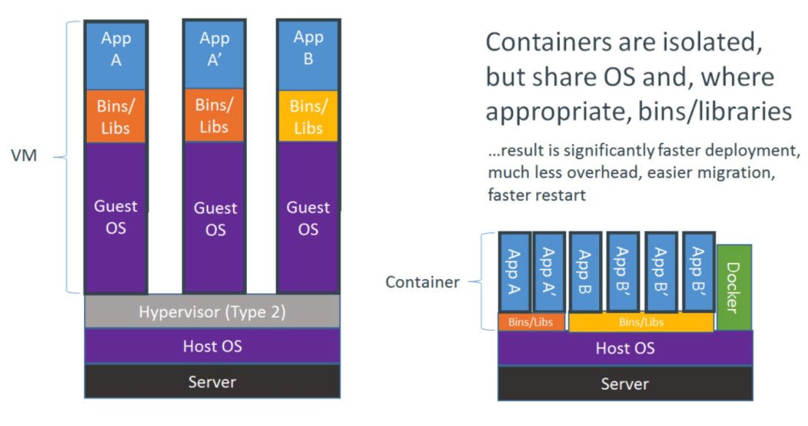
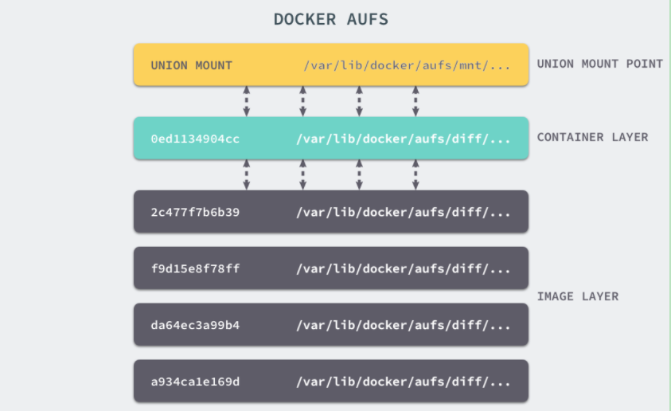
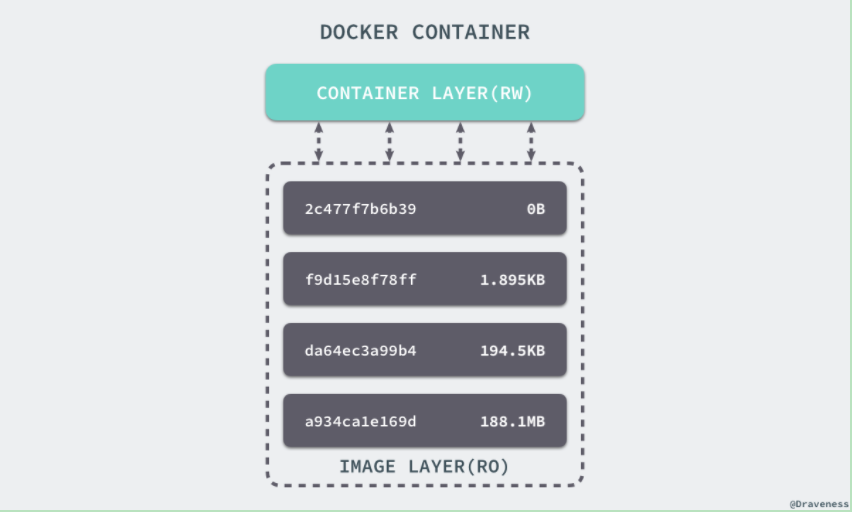
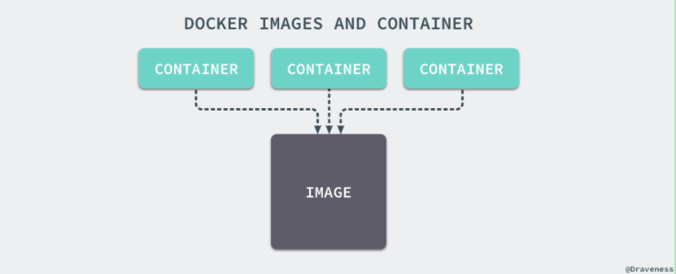
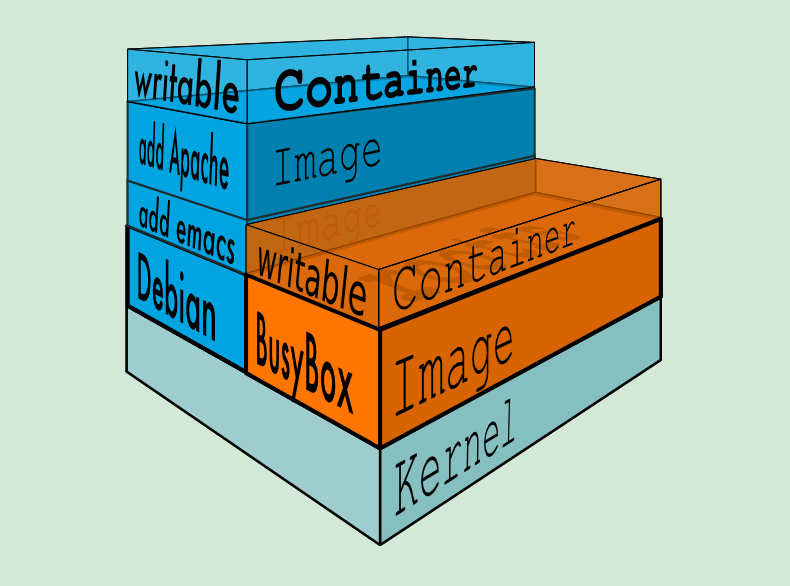

title: docker 底层实现
date: 2019-02-26 18:14:47
tags: docker
categories: 技术
comment: true

### Docker 的底层实现和 Docker 虚拟化技术中的核心技术
Linux 容器不是模拟一个完整的操作系统，而是对进程进行隔离。或者说，在正常进程的外面套了一个保护层。对于容器里面的进程来说，它接触到的各种资源都是虚拟的，从而实现与底层系统的隔离。由于容器是进程级别的，相比虚拟机有很多优势。容器里面的应用，直接就是底层系统的一个进程，而不是虚拟机内部的进程。容器只占用需要的资源，不占用那些没有用到的资源；虚拟机由于是完整的操作系统，不可避免要占用所有资源。另外，多个容器可以共享资源，虚拟机都是独享资源。容器只要包含用到的组件即可，而虚拟机是整个操作系统的打包，所以容器文件比虚拟机文件要小很多。



#### Namespaces
命名空间 (namespaces) 是 Linux 为我们提供的用于分离进程树、网络接口、挂载点以及进程间通信等资源的方法。在日常使用 Linux 时，我们并没有运行多个完全分离的服务器的需要，但是如果我们在服务器上启动了多个服务，这些服务其实会相互影响的，每一个服务都能看到其他服务的进程，也可以访问宿主机器上的任意文件，这是很多时候我们都不愿意看到的，我们更希望运行在同一台机器上的不同服务能做到完全隔离，就像运行在多台不同的机器上一样。

在这种情况下，一旦服务器上的某一个服务被入侵，那么入侵者就能够访问当前机器上的所有服务和文件，这也是我们不想看到的，而 Docker 其实就通过 Linux 的 Namespaces 对不同的容器实现了隔离。

Linux 的命名空间机制提供了以下七种不同的命名空间，包括 CLONE_NEWCGROUP、CLONE_NEWIPC、CLONE_NEWNET、CLONE_NEWNS、CLONE_NEWPID、CLONE_NEWUSER 和 CLONE_NEWUTS，通过这七个选项我们能在创建新的进程时设置新进程应该在哪些资源上与宿主机器进行隔离。

Linux提供了如下几种Namespace

   Namespace   |变量|               隔离资源| 
   ---|---|---| 
   Cgroup      | CLONE_NEWCGROUP  |  Cgroup 根目录| 
   IPC         | CLONE_NEWIPC      | System V IPC, POSIX 消息队列等| 
   Network     | CLONE_NEWNET     |  网络设备，协议栈、端口等| 
   Mount       | CLONE_NEWNS       | 挂载点| 
   PID         | CLONE_NEWPID      | 进程ID| 
   User        | CLONE_NEWUSER     | 用户和group ID| 
   UTS         | CLONE_NEWUTS     |  Hostname和NIS域名| 

#### CGroups
我们通过 Linux 的命名空间为新创建的进程隔离了文件系统、网络并与宿主机器之间的进程相互隔离，但是命名空间并不能够为我们提供物理资源上的隔离，比如 CPU 或者内存，如果在同一台机器上运行了多个对彼此以及宿主机器一无所知的『容器』，这些容器却共同占用了宿主机器的物理资源。

如果其中的某一个容器正在执行 CPU 密集型的任务，那么就会影响其他容器中任务的性能与执行效率，导致多个容器相互影响并且抢占资源。如何对多个容器的资源使用进行限制就成了解决进程虚拟资源隔离之后的主要问题，而 Control Groups（简称 CGroups）就是能够隔离宿主机器上的物理资源，例如 CPU、内存、磁盘 I/O 和网络带宽。

每一个 CGroup 都是一组被相同的标准和参数限制的进程，不同的 CGroup 之间是有层级关系的，也就是说它们之间可以从父类继承一些用于限制资源使用的标准和参数。

Linux 的 CGroup 能够为一组进程分配资源，也就是我们在上面提到的 CPU、内存、网络带宽等资源，通过对资源的分配，CGroup 能够提供以下的几种功能：

参考: [CGroup 介绍、应用实例及原理描述](https://www.ibm.com/developerworks/cn/linux/1506_cgroup/index.html)

Linux 使用文件系统来实现 CGroup，我们可以直接使用下面的命令查看当前的 CGroup 中有哪些子系统：
```
root@ubuntu:~# lssubsys -m
cpuset /sys/fs/cgroup/cpuset
cpu,cpuacct /sys/fs/cgroup/cpu,cpuacct
blkio /sys/fs/cgroup/blkio
memory /sys/fs/cgroup/memory
devices /sys/fs/cgroup/devices
freezer /sys/fs/cgroup/freezer
net_cls,net_prio /sys/fs/cgroup/net_cls,net_prio
perf_event /sys/fs/cgroup/perf_event
hugetlb /sys/fs/cgroup/hugetlb
pids /sys/fs/cgroup/pids
```
大多数 Linux 的发行版都有着非常相似的子系统，而之所以将上面的 cpuset、cpu 等东西称作子系统，是因为它们能够为对应的控制组分配资源并限制资源的使用。

#### AUFS
Linux 的命名空间和控制组分别解决了不同资源隔离的问题，前者解决了进程、网络以及文件系统的隔离，后者实现了 CPU、内存等资源的隔离，但是在 Docker 中还有另一个非常重要的问题需要解决 - 也就是镜像。Docker 镜像其实本质就是一个压缩包。


UnionFS 其实是一种为 Linux 操作系统设计的用于把多个文件系统『联合』到同一个挂载点的文件系统服务。而 AUFS 即 Advanced UnionFS 其实就是 UnionFS 的升级版，它能够提供更优秀的性能和效率。

AUFS 作为联合文件系统，它能够将不同文件夹中的层联合（Union）到了同一个文件夹中，这些文件夹在 AUFS 中称作分支，整个『联合』的过程被称为联合挂载（Union Mount）：




#### 存储驱动

Docker 使用了一系列不同的存储驱动管理镜像内的文件系统并运行容器，这些存储驱动与 Docker 卷（volume）有些不同，存储引擎管理着能够在多个容器之间共享的存储。

想要理解 Docker 使用的存储驱动，我们首先需要理解 Docker 是如何构建并且存储镜像的，也需要明白 Docker 的镜像是如何被每一个容器所使用的；Docker 中的每一个镜像都是由一系列只读的层组成的，Dockerfile 中的每一个命令都会在已有的只读层上创建一个新的层：

```
FROM ubuntu:15.04
COPY . /app
RUN make /app
CMD python /app/app.py
```
容器中的每一层都只对当前容器进行了非常小的修改，上述的 Dockerfile 文件会构建一个拥有四层 layer 的镜像：



当镜像被 docker run 命令创建时就会在镜像的最上层添加一个可写的层，也就是容器层，所有对于运行时容器的修改其实都是对这个容器读写层的修改。

容器和镜像的区别就在于，所有的镜像都是只读的，而每一个容器其实等于镜像加上一个可读写的层，也就是同一个镜像可以对应多个容器。






上面的这张图片非常好的展示了组装的过程，每一个镜像层都是建立在另一个镜像层之上的，同时所有的镜像层都是只读的，只有每个容器最顶层的容器层才可以被用户直接读写，所有的容器都建立在一些底层服务（Kernel）上，包括命名空间、控制组、rootfs 等等，这种容器的组装方式提供了非常大的灵活性，只读的镜像层通过共享也能够减少磁盘的占用。

#### 其他存储驱动

AUFS 只是 Docker 使用的存储驱动的一种，除了 AUFS 之外，Docker 还支持了不同的存储驱动，包括 aufs、devicemapper、overlay2、zfs 和 vfs 等等，在最新的 Docker 中，overlay2 取代了 aufs 成为了推荐的存储驱动，但是在没有 overlay2 驱动的机器上仍然会使用 aufs 作为 Docker 的默认驱动。

不同的存储驱动在存储镜像和容器文件时也有着完全不同的实现，有兴趣的读者可以在 Docker 的官方文档 [Select a storage driver](https://docs.docker.com/storage/storagedriver/select-storage-driver/) 中找到相应的内容。

想要查看当前系统的 Docker 上使用了哪种存储驱动只需要使用以下的命令就能得到相对应的信息：
```
root@ubuntu:docker info | grep Storage
Storage Driver: overlay2
```

#### OverlayFS 和 Overlay2
OverlayFS是一种和AUFS很类似的文件系统，与AUFS相比，OverlayFS有以下特性： 
- 更简单地设计； 
- 从3.18开始，就进入了Linux内核主线； 
- 可能更快一些。 


因此，OverlayFS在Docker社区关注度提高很快，被很多人认为是AUFS的继承者。就像宣称的一样，OverlayFS还很年轻。所以，在生成环境使用它时，还是需要更加当心。Docker的overlay存储驱动利用了很多OverlayFS特性来构建和管理镜像与容器的磁盘结构。 自从Docker1.12起，Docker也支持overlay2存储驱动，相比于overlay来说，overlay2在inode优化上更加高效。但overlay2驱动只兼容Linux kernel4.0以上的版本。 
注意：自从OverlayFS加入kernel主线后，它在kernel模块中的名称就被从overlayfs改为overlay了。但是为了在本文中区别，我们使用OverlayFS代表整个文件系统，而overlay/overlay2表示Docker的存储驱动。

overlay2 中的镜像分层

具体见：[overlya2 官方文档](https://docs.docker.com/storage/storagedriver/overlayfs-driver/#how-container-reads-and-writes-work-with-overlay-or-overlay2)

#### 总结
Docker 目前已经成为了非常主流的技术，已经在很多成熟公司的生产环境中使用，但是 Docker 的核心技术其实已经有很多年的历史了，Linux 命名空间、控制组和 UnionFS 三大技术支撑了目前 Docker 的实现，也是 Docker 能够出现的最重要原因。
